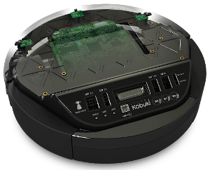

Kobuki ROS Interfaces
=====================

----

ROS2 message, service and action interfaces for the Kobuki.

----

## Documentation

To get started with Kobuki in ROS2, visit the relevant documentation release on read-the-docs:

| ROS2 Distro | Kobuki Documentation Release |
|:------------------:|:----------------------------:|
| Foxy | https://kobuki.readthedocs.io/en/release-1.0.x/ |
